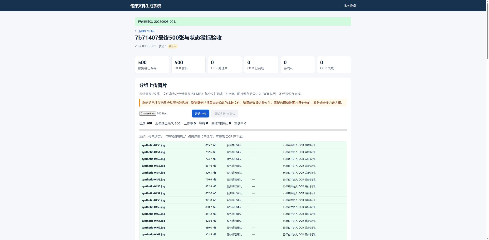

# 第二阶段验证报告

本报告按轮次保留历史结果；证据校正以紧接下方的 2026-09-08 补拍章节为准。
全部验证均使用合成图片和隔离数据库，未读取、修改、删除或重建真实业务数据。

## 证据校正与真实浏览器补拍（2026-09-08，本次结果）

审查/运行 checkout：`49a85633ffc454b7b2ed4bf1cc60c3c98799342f`；
**本次验证程序 SHA：`7b71407bed03eda7a65e4e7803267fba956cd213`**。
开始前完整阅读 AGENTS、Issue #4、阶段任务/验收文档及 PR #5 正文、评论，
本地和 PR 远端均为 49a85633，无新增评论/后续修复。按用户要求继续原 PR 分支，
保留三个既有未跟踪 stop 标记。程序、迁移、测试及验证服务脚本相对 7b71407 无差异；
本次没有发现需修改程序的缺陷，只修正证据说明、补拍及保存新测试输出。

环境沿用 Windows 10 10.0.19045、Python 3.13.5、Waitress 3.0.2 / 8 线程、
Chrome 152.0.7977.82、Node.js v24.19.0。以下时间均为 UTC（本地 Brisbane +10）。
新证据目录：[issue4-evidence-correction-20260908](validation/issue4-evidence-correction-20260908/README.md)。
每张截图的同名 `.dom.json` 保存 SHA、隔离根/批次、操作步骤、捕获前后时间和 DOM。
先读取预期页码/计数，等待稳定并定位画面，再截图，随后再次读取 DOM；六张 PNG
均已重新打开检查真实像素内容，不能只根据文件名或点击返回成功判定。

### 逐项校正和新增证据

| 场景/旧证据实际内容 | 本次操作与实际结果 | 新证据（截图 + 同名 DOM） |
|---|---|---|
| 旧 12 仍为第 1/2 页，不是失败第二页；11 也不能证明第二页 | 新隔离批次 1 上传 26 张损坏夹具，刷新后点击下一页；稳定为第 2/2 页，**仅 1 条，failure ID 1**，总失败 26 | [31](validation/issue4-evidence-correction-20260908/31-failures-page2.png)、[DOM](validation/issue4-evidence-correction-20260908/31-failures-page2.dom.json)；01:59:32.660–01:59:33.990Z |
| 旧 17 为待同步；旧 18 才是元数据已保存、仍未解决，不是成功替换终态 | 新隔离批次 2 注入上传/补写 503，刷新后恢复夹具并等待自动补写；32 为已保存 failure ID 27、图片 0/失败 1。明确为该行选择 synthetic-0081 替换原 synthetic-0080，33 为**保存 1、未解决 0、图片 1 行** | [32](validation/issue4-evidence-correction-20260908/32-outbox-saved-unresolved.png)、[32 DOM](validation/issue4-evidence-correction-20260908/32-outbox-saved-unresolved.dom.json)、[33](validation/issue4-evidence-correction-20260908/33-outbox-replaced-final.png)、[33 DOM](validation/issue4-evidence-correction-20260908/33-outbox-replaced-final.dom.json) |
| 旧 24 为上传前（保存 0、等待 3）；旧 25 为保存 2、失败 1，不是替换终态 | 新隔离批次 3 同组上传 synthetic-0084、damaged-00、synthetic-0085；34 确认保存 2/未解决 1。为 failure ID 28 明确选 synthetic-0086，35 为**保存 3、未解决 0、OCR failed 0、图片 3 行** | [34](validation/issue4-evidence-correction-20260908/34-mixed-saved2-failed1.png)、[34 DOM](validation/issue4-evidence-correction-20260908/34-mixed-saved2-failed1.dom.json)、[35](validation/issue4-evidence-correction-20260908/35-mixed-replaced-final.png)、[35 DOM](validation/issue4-evidence-correction-20260908/35-mixed-replaced-final.dom.json) |
| 旧 28 是第 1/10 页，不能证明第二页 | 重开保留的 server-500-final-20260908 批次 1，仅翻页不上传；36 整页显示**第 2/10 页、50 行、序号 51–100**，保存仍 500 | [36](validation/issue4-evidence-correction-20260908/36-retained-500-page2-full.png)、[DOM](validation/issue4-evidence-correction-20260908/36-retained-500-page2.dom.json)；02:03:20.150–02:03:24.932Z |

新批次 1/2/3 均在 `server-evidence-correction-20260908` / 5057，编号分别为
20260908-001/002/003，不与旧综合数据库的同号批次混同。合成临时根和启动命令见
新目录 README。失败数为 0 时应用原设计隐藏失败面板；33/35 的截图可见本轮
“失败/未确认 0”，服务端未解决为 0 由截图前后 DOM 和独立只读 SQLite 一致确认，
没有改写页面让截图显示额外的零值。

旧证据全部保留，不覆盖任何历史 PNG/DOM/测量文件。旧
`final_browser_dom.json` 是 **2026-09-07T23:21:07.667Z**、e54f7bb checkout
（应用 0acd823）时的第二页 DOM，只含页码/50 行摘要；新 36 是翌日 UTC、
应用 7b71407 重开同一保留批次时的画面和完整 51–100 行，**不是旧 DOM 的配图或
历史上传期间截图**。原 500 张上传、性能和内存已核实，本次没有重跑、没有新采样。

### 完整测试输出：新运行，不补造历史日志

未找回历史 60 pytest / 17 JS 的完整 stdout/stderr；原 `verified_checks.json`
仅是历史摘要，保留原 59.65s，不当作完整日志。因此在上述未变程序上新运行：

```powershell
.\.venv\Scripts\python.exe -m pytest -p no:cacheprovider --basetemp .pytest-tmp-evidence-20260908T015527Z
node --test tests/js/batch_upload_state.test.js tests/js/batch_images.test.js
```

- pytest：**60 passed in 134.17s**，进程墙钟 141.495 秒；
  2026-09-08T01:55:27.870822Z–01:57:49.364734Z，退出码 **0**。
  [完整 stdout](validation/issue4-evidence-correction-20260908/pytest.stdout.txt)、
  [完整 stderr（0 bytes）](validation/issue4-evidence-correction-20260908/pytest.stderr.txt)。
- JavaScript：**17 passed、0 failed**，Node 内部 181.7648 ms，进程墙钟 0.373 秒；
  01:57:49.364832Z–01:57:49.737984Z，退出码 **0**。
  [完整 stdout](validation/issue4-evidence-correction-20260908/javascript.stdout.txt)、
  [完整 stderr（0 bytes）](validation/issue4-evidence-correction-20260908/javascript.stderr.txt)。
- [test_run.json](validation/issue4-evidence-correction-20260908/test_run.json) 保存实际命令、
  时间和退出码；`run_checks.py` 直接把子进程 stdout/stderr 写入独立文件，拒绝覆盖。
  原 39 项 pytest 和领取保护未删除，6 项迁移幂等测试包含在本次 60 项内。
- 本次另执行 Python 编译、三个 JS 语法检查、`pip check`、`git diff --check` 及
  7b71407 程序差异检查，退出码均 0；截图哈希、前后 DOM 条件、JSON 和文档链接
  核验通过。实际新时间/输出见 [delivery_checks.json](validation/issue4-evidence-correction-20260908/delivery_checks.json)。

### 数据核对、限制与收尾

[isolated_state.json](validation/issue4-evidence-correction-20260908/isolated_state.json)
使用 SQLite `mode=ro`：新批次 2 的 failure 27、批次 3 的 failure 28 均 resolved，
各自未解决 0；图片分别 1/3。新库 evidence/不同 SHA/回执/磁盘图片各 4、queued 4、
OCR failed 0、attempt_count 最大 0、外键无错误。新批次 1 **有意保留 26 条未解决**
供复核分页，不能声称本次新库全局失败为 0；26 条全部恢复的历史终态仍引用旧
29 + `final_26_dom.json` 和原数据库摘要，本次 pytest 另覆盖 26/61 条恢复。
保留 500 库仍为 evidence/不同 SHA/回执/关联/磁盘各 500，只有原来的 20 次上传，
本次 UTC 日期新增上传 0。补拍服务已经原执行会话 Ctrl+C 停止，5057/5058 监听 0。

截图 31 第一次 fullPage 捕获曾返回 `Timed out after 5000ms waiting for CDP command
Page.captureScreenshot`，没有生成文件；重新观察稳定页、定位标题后用视口截图成功。
该错误单独记录，不冒称 sandbox 故障。六张新图复核及 SHA-256 见
[visual_review.json](validation/issue4-evidence-correction-20260908/visual_review.json)。
未改系统 ACL、未关闭 sandbox、未触碰真实业务数据、无新增迁移/程序修复；未合并
PR、未进入第三阶段。本次四项证据缺口已补齐；**历史完整测试输出仍不可追溯**，
以明确标时的新运行补充。单标签 renderer 内存、真实浏览器 TCP 静默丢包仍未单独
验证；提交后 503 和全 Chrome 聚合内存不能代替这两项，也没有在本轮扩大结论。

## 状态徽标修复与最终代码复验（2026-09-08，历史运行：7b71407）

**最终验证代码 SHA：`7b71407bed03eda7a65e4e7803267fba956cd213`。**
下节保留同日修复前 `e54f7bb` 的完整浏览器故障场景及规模数据；不能把其中的
15.211 秒或 34.676 ms 转记为本节新提交结果。

截图复核发现：已保存/OCR 分类计数及图片表格会更新，但页首状态徽标仍可能显示
“已创建”。本次已修复：服务端状态轮询同时更新徽标文本及 CSS 状态，中文名称来自
服务端渲染的允许列表，未知状态不插入 HTML。改动仅为
`templates/batch_detail.html`、`static/batch_upload.js`、`static/batch_upload_state.js`
和两份回归测试；没有更改上传事务、失败关联、outbox、迁移或领取版本保护。

### 该轮 7b71407 提交的实际检查（历史摘要）

- 全部 pytest：**60 passed in 59.65s**，原有 39 项保留，含 6 项迁移测试。
  命令：`.venv\Scripts\python.exe -m pytest -p no:cacheprovider --basetemp .pytest-tmp-browser-7b71407-final`。
- JavaScript：**17 passed**，新增状态徽标 queued/completed 更新及未知状态拒绝；
  Python 编译、三个 JS 语法检查、依赖检查和补丁格式检查通过。
- 新建另一个专用标记隔离根 `server-badge-final-20260908`，仍在同一合成临时目录下，
  Waitress 5058 / 8 线程，Chrome 与 Windows 版本同下节。
- 真实浏览器重新选择同一套 **500 张不同 SHA-256** 的 1600×1200 JPEG，
  单图 712,184–1,002,456 bytes、合计 438,074,092 bytes；源文件/OS 缓存未清空，
  **数据库及上传目录全新**。20 组×25 张，净大小 21,186,704–22,471,735 bytes，
  最大在途上传 1。默认 25 张/64 MiB、单文件 16 MiB 未改变。
- 浏览器发出点击 23:30:25.886Z，点击调用返回 23:30:28.823Z，观察到确认 500
  为 23:30:41.076Z，耗时 **15.190 秒**（含控制调度及约 1 秒观察误差）。
  服务端应用处理窗口 23:30:28.911463Z–23:30:40.517436Z，**11.605973 秒**；
  不含首个请求进入 Flask 前的完整接收时间，两种窗口不混称。
- **500 added、0 reused、0 already_in_batch、0 failed**；最终 evidence、不同
  SHA-256、batch_images、upload_receipts、正式磁盘图片均为 **500**；queued 500，
  未解决失败/OCR failed/`.incoming` 文件均为 0，最大 attempt_count=0，外键检查为空。
- 浏览器逐秒观察到顶部徽标从“已创建”变成“排队中”，最后已保存/已确认均为 500，
  图片第一页 50 行；没有手动整页刷新。此处补上了下节发现的展示遗漏。

### 最终性能与内存

所有时间为 2026-09-07 UTC（本地 2026-09-08）。状态每秒采样窗口为
23:29:49.979Z–23:31:03.023Z，共 **73.044 秒、73 样本**，比服务端上传窗口早
38.932463 秒、晚 22.505564 秒，并完整覆盖浏览器操作窗口。

| 指标 | 最终测量 |
|---|---:|
| 完整状态采样 p95 / 最大 | **41.605 / 53.664 ms** |
| 完整窗口状态 HTTP / metrics 失败 | **0 / 0** |
| 服务端上传窗口内状态样本 | 12；p95/最大 53.664 ms；HTTP 失败 0 |
| 服务端采样工作集最大 | **49,455,104 bytes** |
| 服务端进程生命周期峰值工作集 | **50,683,904 bytes** |
| Chrome 全进程工作集开始 / 结束 | 4,088,967,168 / 4,033,339,392 bytes |
| Chrome 全进程采样工作集最大 | **4,173,008,896 bytes** |
| Chrome 全进程采样私有内存最大 | **4,288,307,200 bytes** |

服务端生命周期峰值来自 `GetProcessMemoryInfo/PeakWorkingSetSize`；其余工作集
最大值仅是采样最大值。Chrome 使用 `Get-Process chrome` 的 WorkingSet64 /
PrivateMemorySize64 聚合，共 57 样本，23:30:05.4410947Z–23:31:02.2249537Z，
完整覆盖上传；包含既有无关标签和扩展，**不是单标签内存或生命周期峰值**。
此次未启用 tracemalloc，也未运行 Python 上传客户端。

命令同下节，最终参数分别为 `server-badge-final-20260908`、
`.phase2-validation-browser-monitor-7b71407.stop`、`verified_monitor.json`、
`verified_browser_memory.json` 和 `--commit-sha 7b71407bed03eda7a65e4e7803267fba956cd213`。
状态采样仍访问 `http://127.0.0.1:5058/batches/1/status`；上传由真实文件 chooser 和
页面按钮完成。证据汇总脚本以 `--verified` 从只读隔离 SQLite 与原始事件复算。

证据：[最终汇总](validation/issue4-browser-20260908/verified_summary.json)、
[逐秒状态/服务端内存](validation/issue4-browser-20260908/verified_monitor.json)、
[真实 Chrome 内存](validation/issue4-browser-20260908/verified_browser_memory.json)、
[浏览器计时与徽标状态](validation/issue4-browser-20260908/verified_browser_timing.json)、
[逐请求事件](validation/issue4-browser-20260908/verified_events.jsonl)、
[最终检查](validation/issue4-browser-20260908/verified_checks.json)。



### 结论、证据校正与边界

核心真实浏览器验收和最终代码 500 张规模复验已执行通过；失败分页/替换、断线刷新、
503 退避、混合损坏图、响应抑制重传和迟到图片响应的具体操作与结果见下节，
它们发生在 `e54f7bb`，最后一项应用改动仅同步状态徽标。全部回归已在新 SHA 重跑。
没有新增数据库迁移、没有读取真实业务数据、没有第三阶段实现、没有合并 PR。
验证后已通过原执行会话停止本次两个 Waitress 服务，5057/5058 监听数为 0；
隔离数据库和合成文件保留供核对，未清理用户文件。

截图 13 在最后一条替换页面尚未完成绘制时捕获，显示旧失败行，不能当作“0 失败”
终态截图。随后独立重开原批次，DOM 为保存 26、图片 26 行、失败 0，重新保存
[截图 29](validation/issue4-browser-20260908/29-failures-26-final-settled.png) 和
[final_26_dom.json](validation/issue4-browser-20260908/final_26_dom.json)，并与 SQLite
26 resolved/0 unresolved 一致。截图 11、12 都未显示失败第二页；后续补拍用新目录
31 替代其第二页证明，详见本报告顶部校正章节。

尚未单独验证/测量：单标签 renderer 内存，以及浏览器 TCP 层静默丢弃成功响应。
本轮浏览器响应抑制为提交后返回合成 503，真实连接断开另外通过停止隔离 Waitress
制造；两者不等同于 TCP 丢包。额外跨批次/同名/重复补写交错组合有回归覆盖，
不宣称每种组合都逐一手动操作过。历史阻断和历史 Python 性能数据继续独立保留。

## 真实浏览器验收及 500 张实测（2026-09-08，历史运行：徽标修复前）

此前 sandbox 与文件选择器阻断已经解除。本轮使用受支持的真实 Chrome 扩展控制、
页面文件选择器和上传按钮完成下列操作，**不再以 API 上传或模拟 DOM 代替浏览器验收**。
继续 PR #5 原分支；远端核对时为 `bd32c9a`，没有新增评论。本轮没有合并 PR，
没有进入第三阶段。文档原先要求新建分支，但按用户最新指令继续现有 PR 分支。

### 验证版本、环境与安全边界

- 验证提交：`e54f7bb43caf9d59581f2ab0216c26039b08a865`。
  此提交新增隔离故障/内存验证工具和 3 项工具安全回归；实际应用程序仍为
  `0acd823e7e67684ae4fa9d50fa63aed5fd7f8629`，没有重复修改既有修复。
- Windows 10 `10.0.19045.0`、Python 3.13.5、Waitress 3.0.2（8 线程）、
  Chrome `152.0.7977.82`、Node.js v24.19.0。当地日期为 09-08，原始时间使用 UTC。
- 合成运行根为 `%LOCALAPPDATA%\Temp\dgm-phase2-browser-9def9aedf733486e9cc633a1d4a95335`。
  综合场景使用 `server-acceptance-20260908` / 5057；最终全新增规模验证使用
  **另一个新建的** `server-500-final-20260908` / 5058，没有重建已有数据库。
- `phase2_browser_harness.py` 要求专用 `SYNTHETIC_BROWSER_VALIDATION` 标记，
  显式配置隔离 SQLite/图片目录且只监听 127.0.0.1。故障仅由本地测试控制页启用。
  没有启动正式 `start.bat`，没有读取真实数据库或业务图片，没有再修改 ACL。
- 无新增迁移；迁移 1/2/3 和 `attempt_count` 领取版本保护不变。上传、状态及
  分页不调用 OCR、字段提取、车辆合并或任务领取。测试夹具中的 completed 是
  明确设置的去重回归状态，不是执行或宣称完成了 OCR。

### 真实浏览器场景与实际结果

证据目录为 [issue4-browser-20260908](validation/issue4-browser-20260908/)。
下表批次号指 5057 综合场景数据库，均是 `20260908-00N`。

| 场景 | 实际操作与结果 | 截图/原始证据 |
|---|---|---|
| 51/52 张及 File 保留 | 批次 1 真实选择 51 张，25/25/1 上传，自动更新为 50+1 页；第二页预选另一张，往返切页后不重新选文件直接上传成功，总数 52、第二页 2 行。刷新后保留服务端结果并提示重选本地文件 | 01–03 |
| 服务器确认中 | 批次 2 的响应延迟 8 秒；字节传输完成时显示“服务器确认中”，已确认仍为 0，收到结果后才为 1 | 04 |
| 有限重试及后续组 | 26 张分 25+1，首组连续 3 次 HTTP 503（初次+2 次自动重试），后组仍成功；手动仅重试 25 个未确认项，最终全部确认、25 条失败均解决 | 05、synthetic_events.jsonl |
| 列表错误恢复 | 图片列表持续 503，旧 27 行保留、错误提示可见；恢复服务并点击更新后错误消失、行数不丢失 | 06 |
| 成功响应未交付后的重传 | 提交成功后夹具抑制成功响应、返回合成 503，并把该批次 evidence 标为 completed；浏览器自动重传后批次仍为 28 关联/28 回执，28 张 completed，attempt_count=0 | 07、raw_summary.json |
| 64 MiB 和单文件超限 | 5 张 15,870,054 bytes BMP + 1 张 17,280,054 bytes 超限 BMP + 2 张 JPEG；首组 4 张、63,480,216 bytes，第二组 3 张、17,493,355 bytes；超限 1 张不阻断其余 7 张。明确替换后总数 8、失败 0 | 09、14 |
| 26 条失败分页/替换 | 原终态 26 张、26 resolved/未解决 0 有独立证据；旧 12 实际仍第一页、13 仍在绘制，均不能证明预期终态 | 10；终态 29 + final_26_dom.json；分页补拍新目录 31；replacement-actions.json 仅后 18 次动作 |
| 待同步与刷新 | 上传及补写 503，刷新提示重选；旧 17 为待同步，18 为失败元数据已保存但尚未解决，不能证明成功替换 | 15–18 保留各自实际状态；新目录 32 已保存/未解决，33 保存 1/未解决 0 |
| 实际连接断开与恢复 | 仅停止本次 Waitress，真实页面上传报连接中断并保留待同步元数据；刷新显示 ERR_CONNECTION_REFUSED。用同一数据库重启，重新加载自动补写并提示重选文件；明确重传后总数 2、失败 0，再刷新仍一致 | 19–22 |
| 上传中切页/迟到响应 | 图片响应延迟 5 秒，先刷新第一页、点击下一页并上传预选文件；逐秒观察旧表保留，最后第二页 3 行、总数 53，没有被旧页结果切回 | 23、delayed-page-actions.json |
| 损坏与有效图同组 | 旧 24 是上传前；25 是保存 2/失败 1、OCR failed 0，不是替换终态。原数据库总数 3 的摘要单独保留，不把它冒充旧图内容 | 24–25 保留；新目录 34 为部分成功、35 为替换后保存 3/未解决 0/OCR failed 0 |

综合数据库最终为 505 份不同 SHA-256 evidence/正式图片（500 JPEG+5 BMP），
`.incoming` 文件 0；各批次关联数依次 53/28/500/8/26/2/3，全部未解决失败 0，
外键检查为空，最大 attempt_count=0。26 条与超过默认 25 条上限的 **61 条**完整恢复
另由 pytest 回归覆盖；并非 126 条。跨批次、同名不同图、重复补写与成功重传交错
由既有 Python/JS 回归覆盖，不能把这些额外组合记为逐个浏览器操作。

### 最终全新增 500 张：数据、时间和数量

综合场景先完成过一次 500 张（420 added/80 reused），保留为本轮前一次测量，见
`raw_summary.json`、`raw_monitor.json`、`raw_browser_memory.json` 和截图 08。
**以下最终结果来自 5058 全新隔离数据库，不与前一次或历史 Python 客户端混用。**

- 真实选择 500 张不同内容 JPEG，500 个 SHA-256，分辨率全部 1600×1200；
  单图 712,184–1,002,456 bytes，总净大小 **438,074,092 bytes**（417.78 MiB）。
- 默认 25 张/64 MiB，单文件 16 MiB；实际 **20×25 串行组**，最大在途上传 1；
  每组净大小 21,186,704–22,471,735 bytes。
- 浏览器点击操作发出：2026-09-07T23:18:29.916Z；观察到确认 500：
  23:18:45.127Z；**15.211 秒**。这是操作发出到 UI 确认被观察到的耗时，包含
  控制调度时间（点击调用 23:18:32.937Z 返回）及约 1 秒观察间隔，不是精确网络计时。
- 服务端应用处理窗口：23:18:33.016901Z–23:18:44.500448Z，**11.483547 秒**。
  Waitress 在进入 Flask 前接收请求体，所以该窗口不包含首个请求完整的网络接收时间，
  不应替代上面的浏览器操作耗时。
- 结果：**500 added、0 reused、0 already_in_batch、0 failed**；页面已确认 500、
  已保存 500、queued 500，第一页 50 行，切第二页后也为 50 行。
- 独立数据库最终 evidence/不同 SHA-256/batch_images/upload_receipts/正式磁盘图片
  **全部为 500**；未解决失败 0、OCR failed 0、`.incoming` 0、attempt_count 最大 0、
  `PRAGMA foreign_key_check` 无结果。

最终截图：[500 张全部确认](validation/issue4-browser-20260908/27-final-browser-500-complete.png)。
原始数据：[final_summary.json](validation/issue4-browser-20260908/final_summary.json)、
[浏览器计时](validation/issue4-browser-20260908/final_browser_timing.json)、
[逐请求事件](validation/issue4-browser-20260908/final_events.jsonl)、
[最终 DOM](validation/issue4-browser-20260908/final_browser_dom.json)。
旧截图 28 实际为第 1/10 页；上列历史 DOM 记录第二页，但不是该截图同一时刻的画面。
保留批次的第二页截图与完整 50 行 DOM 已另在新目录 36 补拍，时间/代码见顶部章节。

### 性能窗口与真实内存口径

- 状态接口每秒采样，窗口 23:17:27.695Z–23:18:56.751Z，共 89.056 秒/89 样本；
  比服务端上传窗口早 65.321901 秒、晚 12.250552 秒，完整包含浏览器操作窗口。
  完整窗口 p95 **34.676 ms**，最大 **46.977 ms**，HTTP 失败 **0**；metrics 失败 0。
- 单独截取服务端上传窗口内的 11 个样本，p95/最大均 **35.957 ms**，HTTP 失败 0。
  p95 使用 nearest-rank，小样本 p95 与最大相同是预期，不与完整窗口混用。
- 服务端采样工作集最大 **49,397,760 bytes**；进程生命周期峰值工作集
  **51,490,816 bytes**，来自 Windows `GetProcessMemoryInfo` 的
  `PROCESS_MEMORY_COUNTERS.PeakWorkingSetSize`，包括进程上传前的高水位。
  此次未启用 tracemalloc，原始兼容字段 0 不能解释为“没有 Python 内存占用”。
- 浏览器每秒读取 Windows `Get-Process chrome` 的 `WorkingSet64` 和
  `PrivateMemorySize64`，将全部 Chrome 进程求和。57 个样本，
  23:17:58.7896281Z–23:18:55.5665223Z，完整覆盖上传。
  工作集开始 **4,111,142,912**、结束 **4,189,855,744**、采样最大
  **4,433,862,656 bytes**；私有内存采样最大 **4,374,765,568 bytes**。
  **包含用户既有无关标签和扩展，不能归因为本测试单标签内存，也不是生命周期峰值。**
  没有把 Python 上传客户端内存充当浏览器内存。

原始证据：[状态/服务端内存](validation/issue4-browser-20260908/final_monitor.json)、
[Chrome 实际内存采样](validation/issue4-browser-20260908/final_browser_memory.json)。
没有保存页面标题、进程命令行或真实业务数据。

### 命令、自动化及交付检查

以 `$phase2BrowserRun` 表示上面的已解析合成根，`$evidence` 表示本轮证据目录。
实际使用项目 `.venv\Scripts\python.exe`，命令中的变量需先在本机设置；未使用生产启动器。

```powershell
.\.venv\Scripts\python.exe scripts\phase2_browser_harness.py "$phase2BrowserRun\server-500-final-20260908" --port 5058
.\.venv\Scripts\python.exe scripts\phase2_validation.py monitor http://127.0.0.1:5058 1 .phase2-validation-browser-monitor-final-20260908.stop "$evidence\final_monitor.json" --commit-sha e54f7bb43caf9d59581f2ab0216c26039b08a865
.\scripts\measure_browser_memory.ps1 -StopFile "$PWD\.phase2-validation-browser-monitor-final-20260908.stop" -OutputFile "$evidence\final_browser_memory.json"
.\.venv\Scripts\python.exe -m pytest -p no:cacheprovider --basetemp .pytest-tmp-browser-20260908-delivery
node --test tests/js/batch_upload_state.test.js tests/js/batch_images.test.js
.\.venv\Scripts\python.exe -m compileall -q app.py config.py database.py storage.py worker.py scripts tests
.\.venv\Scripts\python.exe -m pip check
node --check static/batch_upload.js
node --check static/batch_upload_state.js
node --check static/batch_images.js
git diff --check
```

上传本身由浏览器 chooser 选取全部 500 个文件并点击“开始上传”，没有 Python upload
命令。停止采样由本次专用 stop 文件触发；复跑应使用新的 stop 文件而非已有标记。
原有 39 项 pytest 保留，本轮集合为 59 项（含 6 项迁移测试和 3 项新工具测试），
前一完整运行为 59 passed in 63.38s；交付复跑结果见 `raw_checks.json`。
JavaScript 16 passed，Python 编译、三个 JS 语法、依赖检查通过。真实 Chrome
访问 Windows/Waitress 并完成上传，同时覆盖最小启动验证。

### 限制与未单独测量项

- 已完成上述真实浏览器功能场景与全新增规模验证；未单独测量浏览器单标签/renderer
  内存。全部进程聚合值只能作为该次整机 Chrome 观察，不得推断每张图片内存成本。
- “响应丢失”浏览器夹具是提交后抑制成功 JSON 并返回 503，并非 TCP 层静默丢包；
  真实连接拒绝另行完成。历史 TCP 丢包客户端回归仍单独保留，不冒充本次浏览器操作。
- 26 条替换途中控制工具超时并失去旧标签连接；新连接只读核对已成功 8 条后继续，
  最终 18 条逐条动作另存 JSON；服务端事件保留全 26 条。截图 11 在分页完成前截取，
  **不作为第二页证据**；旧 12 也仍是第一页，后续新目录 31 才是第二页补拍。一次计数定位器超时发生在最终
  500 张上传前，核对已选择 500 后才开始计时，未重复选择或上传。
- 顶部批次状态文字在不整页刷新时可能保留打开页面的值；本轮要求的已保存/OCR
  分类计数和图片列表都已实际更新。该展示限制保留记录，没有借验收扩展其他阶段。
- 第三阶段 OCR Worker、GPU OCR、车辆匹配和 Excel 仍未实现；不自动合并 PR。

## Sandbox 恢复与真实浏览器续验（2026-09-07 至 09-08，历史结果）

用户明确授权后，仅在 `D:\Codes\DGM\.git` 目录自身为 `LUIGIWIN\swei` 添加
`WRITE_DAC`，未设置继承标志，未递归修改，保留原所有者和其他 ACE。修改前安全
描述符保存在本机临时文件 `dgm-git-acl-before-20260907T123412.json`。授权命令
退出码 0；默认 `workspace-write` 命令已成功运行，实测身份为
`LUIGIWIN\CodexSandboxOffline`（SID 末段 1003）。2026-09-07T12:36:52.979Z
setup 日志 `errors=[]`，Codex 正常安装了 `.git` 保护性 deny ACE。**sandbox
启动故障已经恢复。**

随后运行原程序代码 `0acd823e7e67684ae4fa9d50fa63aed5fd7f8629`（checkout
`7b7dc36382de22a990a923aca42f6ab4232e406a`），在既有纯合成临时根下面新建
`server-resumed-20260907T1237` 隔离数据库/图片目录，启动 Waitress 5057。
真实 Chrome 已打开 `/batches`，点击新建批次、输入“浏览器 51 张验证”并提交，
成功显示批次 `20260907-001`，已保存 0、图片列表为空。页面同时显示 25 张/64 MiB
配置和刷新后需重选文件的提示；这些文案观察不等于相关行为验收通过。

文件 chooser 已触发并返回 `multiple=true`；尝试选择 51 张合成 JPEG 时，扩展
`fileChooser.setFiles` 返回 `-32000 / Not allowed`。其官方随附故障指引要求
ChatGPT 扩展启用 “Allow access to file URLs”；本轮未更改该权限。随后尝试受支持
的 Windows 原生 Chrome 窗口流程，computer-use 因无法可靠确认当前浏览器 URL
而终止本轮控制，已停止后续页面输入。这是浏览器控制阻断，已不再是 sandbox setup
失败。没有完成图片上传、51/52 分页、500 张规模、故障重试或浏览器内存测量。

真实页面截图为
[01-created-batch.png](validation/issue4-browser-resumed-7b7dc36/01-created-batch.png)，
只包含合成批次；实际操作与 ACL 恢复摘要见
[raw_acl_browser_recovery.json](validation/issue4-browser-resumed-7b7dc36/raw_acl_browser_recovery.json)。
隔离服务 PID 29860 已通过原执行会话终止，5057 监听数 0，临时数据保留。
本轮只修改文档/证据，无程序代码或迁移变更；未读取敏感 sandbox 凭据，未访问
真实数据库及业务图片。**浏览器验收仍未完成，第二阶段未全部通过。**

## Sandbox 底层错误核实（2026-09-07，历史诊断）

本轮读取实际轮转日志 `%CODEX_HOME%/.sandbox/sandbox.2026-09-07.log`；
无日期的 `sandbox.log` 不存在。未读取或输出 `.sandbox-secrets`。该轮复现为
2026-09-07T12:17:26.618664900Z：在 `workspace-write` 模式启动只读 `whoami`
之前，setup helper 失败；命令本身未执行。

- Codex CLI：`0.153.4`，本机二进制目录标识 `8e5b6932251c2c1c`。
- Codex Desktop 包：`26.901.6511.0`；Windows：`10.0.19045.0`。
- 失败对象：`D:\Codes\DGM\.git`（普通目录，无重解析链接）。
- 失败操作：`deny ACE failed`，调用 `SetNamedSecurityInfoW` 设置保护性 DACL。
- 底层 Win32 错误：`5 / ERROR_ACCESS_DENIED / Access is denied`；helper 退出码 `1`。
- 随后的 `read-acl-only mode` 返回 `read ACL run completed`。日志没有将
  `.pytest_cache` 列为本次 setup refresh 失败对象。

### 身份、既有修复及更正

此前用户授权的 `.pytest_cache` 读取修复授予 `LUIGIWIN\swei`（本机 SID 末段
`1001`）读取/遍历权限，内部条目继承此授权；6 个文件已经验证可读，所有者仍为
`LUIGIWIN\CodexSandboxOffline`（末段 `1003`）。这与 sandbox 本地账户并非
同一身份；`CodexSandboxOnline` 的 SID 末段为 `1004`，两者均属于
`CodexSandboxUsers`。Offline 作为缓存所有者仍保有 OWNER RIGHTS FullControl。
未实际启动的 sandbox 子进程无法执行 `whoami`；不能把本机 Codex 父进程的
`swei` 身份误记成已经观测到的 sandbox 子进程身份，也未读取账户凭据验证登录。

当时 Codex 父进程由 `swei` 运行，非提升令牌中 Administrators 仅用于 deny。
`.git` 所有者是 Offline，DACL 给 Authenticated Users / CodexSandboxUsers
Modify，给 Administrators FullControl；没有给 `swei` 有效的 ChangePermissions
授权。Modify 不包含修改 DACL 的 `WRITE_DAC`。结合 helper 的错误，当时证据
指向 setup 阶段不能为 `.git` 安装拒绝 ACE；未捕获短生命周期 helper 自身令牌，
其身份沿用父进程是推断。**此前 `.pytest_cache` 是根因的推测已被本轮日志更正。**

### 待授权的最小对象及权限

拟仅在 `D:\Codes\DGM\.git` 目录自身为 `LUIGIWIN\swei` 添加
`WRITE_DAC / ChangePermissions`（icacls 的 `WDAC`），不设置 `(OI)(CI)`、不使用
`/T`、不改所有者、不重置现有 ACL。此权限让当前用户进程修改该目录 DACL，目的
是允许 Codex 正常添加 sandbox 保护性拒绝 ACE；它不是给 sandbox 用户增加写权限。
由于该目录是 Git 元数据且权限超出已授权的缓存读取修复，本轮未执行该建议。
执行前需保存该目录当前安全描述符，执行后验证新 sandbox 启动及实际运行身份；
不能仅凭授权命令返回成功就认定恢复。

诊断发生时 checkout 为 `58178f3a04b74c5e8d215a9b3594394a188a63b1`，程序代码仍为
`0acd823e7e67684ae4fa9d50fa63aed5fd7f8629`。本轮无程序或数据库迁移变更，未新开
验证服务，未访问真实数据。浏览器仍无法启动，故没有新截图、页面操作或浏览器
内存证据，**浏览器验收未完成**。脱敏日志与诊断摘要见
[raw_sandbox_diagnosis.json](validation/issue4-browser-0acd823/raw_sandbox_diagnosis.json)。

## 按 6473329b 执行本机浏览器验收（2026-09-07，历史尝试）

本轮按提交 `6473329bab725d387bed5501a96e387875bd0adf` 新增的
[Windows 本机浏览器验收清单](PHASE_2_BROWSER_ACCEPTANCE.md) 执行。运行时
checkout 为 `6473329b`；该提交相对验证程序提交
`0acd823e7e67684ae4fa9d50fa63aed5fd7f8629` 只有文档差异，程序文件未改变。

### 已完成的隔离环境准备

- 系统临时运行根目录：
  `%LOCALAPPDATA%\Temp\dgm-phase2-browser-9def9aedf733486e9cc633a1d4a95335`。
  本轮准备和受阻诊断记录窗口为
  2026-09-07T07:30:20.940Z–07:37:52.580Z（UTC）。
- 新生成 500 张不同 SHA-256 的 1600×1200 JPEG；单图
  712,184–1,002,456 bytes，平均 876,148 bytes，总计 438,074,092 bytes。
  另生成 36 bytes 的故意损坏图片。数据均为合成数据。
- 使用该临时目录中的隔离 SQLite 和上传目录启动 Waitress，PID 11524，地址
  `http://127.0.0.1:5057/batches`；直接最小读取返回 HTTP 200 且找到预期标题，
  服务标准错误日志为 0 bytes。
- 验证结束后仅停止上述精确 PID，5057 监听数为 0。临时数据保留供后续续跑；
  未读取、修改、删除或重建真实数据库、业务图片、备份或导出文件。

准备命令分别为 `phase2_validation.py generate <run-root>\images --count 500
--width 1600 --height 1200`、`phase2_validation.py inspect <run-root>\images`
和 `phase2_validation.py serve <run-root>\server --port 5057`，均使用项目
`.venv\Scripts\python.exe`。原始记录使用占位符隐藏本机用户目录；实际根目录
已在运行时解析为系统临时目录。

### 真实浏览器阻断与准确结论

按 computer-use 技能要求，先初始化 `@oai/sky` 受信任 Node 会话。第一次返回
`trusted Node process exited unexpectedly; kernel reset, rerun your request`；按技能
恢复规则只重试一次，第二次在窗口枚举前返回
`windows sandbox failed: helper_unknown_error: setup refresh had errors`。随后使用当前
环境的统一 CUA 备用入口调用 `cua.getState()`，同样在枚举任何应用或窗口前返回
相同 sandbox setup refresh 错误。

只读诊断确认 `D:\Codes\DGM\.pytest_cache` 是既有目录且 `Get-Item` 可读，但
`Get-Acl` 返回 `Attempted to perform an unauthorized operation`，`icacls` 返回
`Access is denied`、处理 0 个文件并失败 1 个文件。这与三个 UI 后端错误中的
workspace sandbox refresh 阶段一致；本轮没有改变该目录或 ACL，也没有绕过系统
保护。修复、移动或删除该既有目录需要另行明确授权。

因此本轮没有成功枚举浏览器窗口，没有打开应用页面，没有页面点击或原生文件选择，
浏览器上传数为 0；没有截图、浏览器版本或浏览器内存记录。51/52 张分页与 FileList
保留、500 张原生浏览器分组上传、64 MiB 边界、单文件超限隔离、服务器确认态、
有限重试、手动重试、刷新/outbox 恢复、26 条失败分页与替换、响应丢失安全重传及
最终 DOM 统计全部保持“未验证”。HTTP 200 只证明隔离服务可启动，不是浏览器
验收证据。

原始结构化事实见
[raw_local_computer_use_attempt.json](validation/issue4-browser-0acd823/raw_local_computer_use_attempt.json)。
程序代码未改变，因此没有把既有自动化测试或 500 张 Python 客户端规模结果重复
登记为本轮新结果。**浏览器验收未完成，第二阶段尚未全部通过；PR 未合并，也未
进入第三阶段。**

## 命令修订与浏览器验收交接（2026-09-07，历史结果）

本次仅更新文档：Windows 命令已改为单行，不再使用反斜杠续行。
规模验证命令中的 `<fresh-stop-file>`、`<raw_monitor.json>` 等仍是历史命令
参数占位符，不应原样执行或覆盖已提交证据。新一轮浏览器验收使用
[Windows 本机操作步骤](PHASE_2_BROWSER_ACCEPTANCE.md)，其中提供无占位符的单行准备命令。

本轮用 `0acd823` 代码在临时数据库启动 Waitress，进程内验证 `GET /batches`
HTTP 200 且包含“批次管理”。云端 Chrome 打开同一本地 URL 时返回
`net::ERR_BLOCKED_BY_CLIENT`，未发生实际应用交互。验证服务已停止。
按 control-browser 技能要求，未换用其他浏览器控制通道绕过限制。

程序代码和此前 Windows 测量未改变，本次不重复记入自动化或性能通过次数。
下一步仍是本机真实浏览器验收，第二阶段尚未全部通过；未合并 PR，未进入第三阶段。

## 按 3413bc6b 补修与 Windows 验收（2026-09-07，历史结果）

本节仅保留该轮历史结果。验证代码提交为
`0acd823e7e67684ae4fa9d50fa63aed5fd7f8629`，基线为
`3413bc6b54bf4a6896f8420b95c2db42c4e510f9`。继续使用 PR #5 的
`codex/issue-4-batch-upload-progress` 分支，未合并，也未进入第三阶段。

### 1. 复核后发现并修复的问题

1. 上传结束调用状态轮询时，如果旧轮询正在进行，旧实现会立即返回。图片列表虽有
   强制补读，批次统计却可能暂时停留在上传前，直到下一次定时轮询。现在普通状态
   读取合并，最终强制读取会在旧请求后串行补读一次，调用者等待补读完成。
2. 同页图片读取在上传结束强制刷新时，上传前启动的响应仍可能短暂渲染。现在强制
   刷新会使旧响应失效，并对图片和状态 GET 显式使用 `cache: "no-store"`。
3. 状态与图片 loader 都曾存在 Promise 循环已退出、`pending` 尚未由外层
   `.finally` 清空的微任务窗口；此时到达的 force 会挂到已经结束的 Promise，
   后续读取丢失。现在 `pending` 在 runner 内同步清空，并用精确微任务顺序回归。
4. 性能采样器原来只捕获 HTTP 状态错误。连接拒绝、超时、正文截断
   `IncompleteRead`、非法 JSON 或合法但非对象的 JSON 可能终止整段采样。
   现在这些情况保存为 `status=0` 的原始失败样本，状态与 metrics 失败分别计数。

上述修改没有新增数据库迁移；版本 1/2/3、SHA-256 去重和第一阶段
`attempt_count` 领取版本保护保持不变。上传、状态、图片列表和失败分页没有调用
OCR、字段提取、车辆合并或任务领取。

### 2. 该轮提交的自动化与 Windows 最小启动

环境：Windows 10 10.0.19045 SP0，Python 3.13.5，Node.js v24.19.0，
Waitress 3.0.2（8 线程）。

- `.venv\Scripts\python.exe -m pytest -p no:cacheprovider --basetemp .pytest-tmp-0acd823-full`：**56 passed in 70.43s**。原 39 项保留；其中
  6 项迁移测试覆盖重复执行、v1/v2→v3 和外键检查。
- `node --test tests/js/batch_upload_state.test.js tests/js/batch_images.test.js`：**16 passed**。新增覆盖最终状态补读、
  同页旧响应失效，以及状态/图片两条 Promise settlement-gap。
- Python `compileall`、三个前端 JavaScript 的 `node --check`、
  `pip check`（No broken requirements found）和 `git diff --check`：通过。
- Waitress 命令：

      .venv\Scripts\python.exe scripts\phase2_validation.py serve  .phase2-validation-0acd823-20260907-162512\server --port 5056

  `GET /batches` 返回 HTTP 200 且包含“批次管理”。验证后只停止该命令的精确
  PID 1536，5056 端口监听数为 0。

检查与启动证据：
[raw_checks.json](validation/issue4-final-0acd823/raw_checks.json)、
[raw_startup.json](validation/issue4-final-0acd823/raw_startup.json)。

### 3. 该轮提交的 500 张 Windows / Waitress 规模验证

验证命令：

    .venv\Scripts\python.exe scripts\phase2_validation.py monitor  http://127.0.0.1:5056 1 <fresh-stop-file> <raw_monitor.json>  --commit-sha 0acd823e7e67684ae4fa9d50fa63aed5fd7f8629
    .venv\Scripts\python.exe scripts\phase2_validation.py upload  http://127.0.0.1:5056 .phase2-validation-fix\images <raw_upload.json>  --group-size 25 --batch-id 1  --commit-sha 0acd823e7e67684ae4fa9d50fa63aed5fd7f8629

数据和分组：

- 500 张 JPEG，500 个不同 SHA-256，全部 1600×1200。
- 单图 712,306–1,002,547 bytes，平均 876,248 bytes；总净大小
  438,123,918 bytes（约 417.83 MiB）。
- 20 组，每组 25 张；每组净大小 21,189,799–22,474,469 bytes，
  multipart 请求 21,202,592–22,487,262 bytes，均低于 64 MiB。
- 配置为单文件最多 16 MiB、每组最多 25 张/64 MiB；请求并发数 1。

上传窗口为 2026-09-07T06:25:51.911Z 至 06:27:06.840Z，共
**74.929 秒**。第 2 组模拟请求中途断开后安全重传；第 3 组完整发送后丢弃
响应再重传。客户端可观察结果为 475 `added`、0 `reused`、
25 `already_in_batch`、0 `failed`；第 3 组第一次响应虽被丢弃，服务端
已确认 25 张，重传没有重复保存。

最终 batch 1：

- evidence 500、不同 SHA-256 500、batch_images 500、upload_receipts 500；
- 正式哈希文件 500、未解决 upload_failures 0；
- queued 500、OCR failed 0；第二阶段未运行 OCR，因此 queued 符合预期。

性能采样窗口为 2026-09-07T06:25:49.884Z 至 06:27:08.932Z，共
79.048 秒；比上传提前 2.027 秒开始、延后 2.092 秒结束，完整覆盖上传窗口。

- 每秒采样状态接口，共 79 个样本；状态 HTTP 失败 0，metrics HTTP 失败 0。
- 状态响应 p95 90.537 ms，最大 147.109 ms。
- 服务端**采样工作集最大值**：52,453,376 bytes（约 50.02 MiB）。
- 服务端**进程生命周期峰值工作集**：54,509,568 bytes（约 51.98 MiB）。
  来源是服务端进程的 Windows `GetProcessMemoryInfo` /
  `PROCESS_MEMORY_COUNTERS.PeakWorkingSetSize`，不是每秒工作集样本的别名。
- Python tracemalloc 服务端峰值 4,291,093 bytes。Python 上传客户端
  tracemalloc 峰值 66,981,056 bytes，只属于验证客户端，**不是浏览器内存**。

原始证据：
[raw_upload.json](validation/issue4-final-0acd823/raw_upload.json)、
[raw_monitor.json](validation/issue4-final-0acd823/raw_monitor.json)。

### 4. 混合失败恢复与 51 张分页

- 同组上传两张有效图和一张损坏图时，两张有效图均成功关联，损坏图生成一条精确
  失败记录；用另一张有效图明确替换后，批次总数为 3，未解决失败数为 0。
- fresh batch 通过 25/25/1 三个串行请求上传 51 张不同合成图，最终总数 51、
  未解决失败 0；图片接口第一页 50 条、第二页 1 条、`page_count=2`，
  `view=table` 第二页包含预期文件名。
- 该 51 张操作由 Python HTTP 客户端及直接 API 读取完成，只证明服务端分组、
  幂等和分页终态，**不视为真实浏览器自动刷新或 File 对象保留证据**。

证据：
[raw_mixed.json](validation/issue4-final-0acd823/raw_mixed.json)、
[raw_upload_51.json](validation/issue4-final-0acd823/raw_upload_51.json)、
[raw_ui_51_api.json](validation/issue4-final-0acd823/raw_ui_51_api.json)。

### 5. 真实浏览器验收仍未完成

按 `browser:control-in-app-browser` 技能连接最终 SHA 的本地隔离页面时，受支持
运行时在加载浏览器文档和打开页面之前退出：
`trusted Node process exited unexpectedly; kernel reset`。同一宿主的前一次
诊断为 `windows sandbox failed: helper_unknown_error: setup refresh had errors`。
因此没有应用内交互、截图或浏览器内存数据；未使用 standalone Playwright 或其他
通道绕过限制。证据：
[raw_browser_attempt.json](validation/issue4-final-0acd823/raw_browser_attempt.json)。

故仍不能宣称第二阶段全部通过。以下项目仍需在可访问本地服务的受支持浏览器完成：

1. 实际选择 51/500 张文件并观察 25 张/64 MiB 分组、串行请求、100% 后
   “服务器确认中”、最多 2 次自动重试和失败组不阻断后续组。
2. 上传结束无整页刷新地更新统计与 50+1 图片分页；第二页补传、上传中切页和
   延迟旧响应不能覆盖新页，并验证预选 native `FileList` 保留。
3. 列表失败后的旧数据保留/按钮恢复、仅手动重试失败或未确认文件、失败分页与
   替换文件重试、断网 outbox/刷新提示、响应丢失后的页面安全重传。
4. 保存真实操作截图及可准确归因的浏览器内存；Python 客户端内存不得替代。

全部运行数据位于新的 `.phase2-validation-0acd823-20260907-162512` 隔离根；
源合成图只读复用。未读取、修改、删除或重建 `data/vehicles.db`、业务上传、
备份或导出文件。

## 图片列表刷新修复（2026-09-07，历史结果）

本节保留 3413bc6b 时记录的历史结果；其浏览器限制和未完成项已由后续
Windows 运行重新核对。下方一、二节继续保留更早的 Windows 验证与历史结果。

- 验证代码提交：`26f232093d7e4e90b62f2b6cff1441f9cb725e98`。
- 基线：`1613ec18dca0fee88a51af53ef17919597cfe747`；继续原 PR #5 分支，未合并。
- 环境：Linux / Python 3.12.13 / Node.js v24.19.0。当时环境不能访问用户的
  Windows 正式部署目录，所有测试使用临时数据库、合成图片。

### 修复内容

此前上传结束只刷新统计和失败记录，“批次图片”仍停留在打开页面时的状态。
本次将表格及分页抽成共用 Jinja 片段，通过现有图片接口的 `view=table` 参数
读取。初次页面及局部更新使用同一模板，文件名继续自动转义。

- 上传结束后强制补一次最新读取；状态轮询时更新当前页。
- 默认每页 50 条，最多 100 条；COUNT 与当前页在同一个 SQLite 读快照中读取。
- 分页链接局部切换，上传表单和失败替换选择器不被替换，不清空已有 File 对象。
- 图片列表请求串行，普通轮询合并；迟到的旧页响应不能覆盖用户新选择的页码。
- 更新失败保留旧表格并显示提示；后续轮询或“更新图片列表”按钮可恢复。
- 原图片 JSON 字段保留，新增 `page_count`；越界页码收敛至有效页。
- 无新增迁移，现有版本 1/2/3 和 attempt_count 领取保护保持不变。

关键修改：`app.py`、`database.py`、`static/batch_images.js`、
`static/batch_upload.js`、`templates/_batch_images.html`、
`templates/batch_detail.html`、新增 Python/JS 回归测试及 README/验收标准。

### 本次验证

- `python -m pytest -q -p no:cacheprovider --basetemp <唯一临时目录>`：
  **54 passed in 2.21s**，包含原 52 项及新增 2 项。
- `node --test tests/js/*.test.js`：**11 passed**，包含原 7 项及新增 4 项。
- Python compileall、三个前端 JS 文件的 `node --check`、`pip check`、
  `git diff --check`：通过。
- Waitress 在同一隔离验证进程的临时端口启动：`GET /batches` HTTP 200，
  含“批次管理”；验证服务已关闭。
- 新增覆盖空状态→有图、50→51 张新增分页、第二页记录、页码/每页上限、
  文件名 HTML 转义、旧页迟到响应、轮询合并、上传结束强制读取、失败保留旧数据及恢复。
- 未调用 OCR、车辆合并、Excel 导出或第三阶段功能；未触碰真实数据库及业务目录。

原始摘要：[ui_refresh.json](validation/issue4-ui-refresh/ui_refresh.json)。

### 浏览器与平台限制

本次通过 control-browser 技能成功连接云端 Chrome，但打开隔离本地页面时
先发生 `Transport closed`，随后浏览器明确返回 `net::ERR_BLOCKED_BY_CLIENT`。
没有发生应用内真实交互；未取得应用截图或浏览器内存。按浏览器技能约束未改用
其他浏览器控制通道绕过限制，Node 回归结果不代替真实浏览器验收。

因此第二阶段仍未全部验收。后续需在可访问本地服务的受支持浏览器中验证：

1. 选择 51 张不同合成图片上传，无手动刷新时表格由空变为 50 行并出现第二页。
2. 切到第二页后补传图片，统计、当前页内容及页数正确更新；提前选择的其他文件保留。
3. 上传中切页及延迟响应时，旧页不能覆盖新页；列表接口失败后能恢复。
4. 完成此前要求的分组、服务器确认、有限重试、失败分页/替换、断网补写、刷新恢复、
   响应丢失重传场景，并保留合成截图及浏览器内存测量。
5. 对当前代码完成 Windows / Waitress 启动与必要回归。

此前 Windows 的 500 张、137.401 秒等数据仍只对应 `f0e72da`，本次未重跑，
不得转记为本次代码或浏览器的验证结果。

## 一、初次审查修复验证（2026-09-07，历史结果）

### 1. 验证版本与环境

- 验证代码提交：f0e72dabcf0f8c8a02bd28ffb1fc2456d1600779。
- 审查基线：152d9474bc672cf169cf1b686c39952aa95fd47c。
- 分支：codex/issue-4-batch-upload-progress。
- 平台：Windows 10 10.0.19045 SP0，64 位。
- Python：3.13.5（Anaconda build，MSC v.1929）。
- Web 服务：Waitress 3.0.2，8 个线程，本机回环地址。
- JavaScript：Node.js v24.19.0。
- 数据：.phase2-validation-fix 下的隔离数据库、上传目录和 500 张合成图。

该轮验证前已核对 PR #5 当时的提交和评论：远端仍停留在审查基线，没有后续修复或
未处理评论，因此所有修复都从该基线继续完成。

### 2. 发现的问题与修复

1. 状态接口曾只返回最近 25 条失败记录，轮询会覆盖前端关联状态。现在状态
   轮询只返回未解决数量和轻量修订标识；完整失败记录由默认 25 条、最大 100
   条的分页接口读取，COUNT 和当前页处于同一个 SQLite 读快照。
2. 原实现按文件名和大小猜测失败关联。现在每条失败记录提供独立文件选择器，
   上传携带精确 failure ID 和 batch 内 client_id；名称和大小允许变化，服务端
   拒绝错误 client_id、跨批次和已经由其他内容解决的关联。
3. 断网补写失败曾被直接忽略。现在浏览器 outbox 明确区分 pending 和 saved，
   只在 localStorage 保存 client_id、显示名、大小、失败类型和创建时间，不保存
   图片内容或 File 对象；页面加载、online 事件和手动按钮触发有界重试，每轮
   最多自动重试 2 次并退避。POST/GET/status 都有 15 秒超时，分页恢复另有最高
   30 秒退避。
4. 迟到失败补写可能重开已成功记录。迁移 3 新增 upload_receipts，并给
   upload_failures 增加 resolved_evidence_id；成功回执、evidence、batch_images
   和失败解决在同一事务提交，重复或迟到补写返回 already_confirmed。
5. 两个标签页并发使用同一 client_id 上传不同内容时，失败请求可能留下未引用
   的正式文件。现在图片先在 .incoming 校验和计算 SHA-256，取得 BEGIN
   IMMEDIATE 写锁并二次校验回执后才落到正式内容寻址路径；正常并发冲突或事务
   回滚只清理本请求新建的文件，且在释放写锁前完成。
6. 前端还修复了同步尾声新 outbox 项漏传、分页响应覆盖刚选择的 File、迟到
   saved ACK 覆盖 confirmed、刷新恢复条目与显式替换生成幽灵行，以及传输进度
   提前显示 100% 等竞态。

已有第一阶段 attempt_count 领取版本保护未改动。上传、状态和失败分页路径不
调用 OCR、字段提取、车辆合并或任务领取；未实现 GPU OCR、Excel 导出或第三
阶段功能。

### 3. 自动化与静态验证

在验证提交上执行：

    python -m pytest -p no:cacheprovider --basetemp .pytest-tmp-verified-f0e72da

结果：52 passed in 96.19s。审查基线已有 39 项全部保留，新增 13 项。新增覆盖
26 条和 61 条失败记录分页恢复、替换后名称/大小变化、同名不同图、重复重试、
跨批次拒绝、断网补写幂等、成功与补写交错、两个标签页同 key 不同内容并发、
事务回滚文件清理，以及 v2→v3 兼容迁移。全部重试成功后未解决失败数为 0。

其他检查：

- tests/test_migrations.py 的 6 项迁移测试包含重复 migrate、保留表/列后重跑
  迁移 3、v1/v2 升级和 PRAGMA foreign_key_check，均随完整测试通过。
- Node --test tests/js/batch_upload_state.test.js：7 passed，包含分组边界、仅元
  数据刷新恢复、重复补写/确认幂等、already_confirmed 交错、最多 2 次重试和
  恢复条目复用。
- Node --check static/batch_upload.js 和 static/batch_upload_state.js：通过。
- .venv\Scripts\python.exe -m compileall -q app.py config.py database.py storage.py worker.py scripts tests：通过。
- .venv\Scripts\python.exe -m pip check：No broken requirements found。
- git diff --cached --check：通过。
- 静态扫描只在数据库/Worker 自检定义任务领取；Web 上传和状态路径没有 OCR、
  字段提取或车辆合并调用。
- Waitress 最小启动：GET /batches 返回 HTTP 200 且包含“批次管理”；验证后
  5054 端口监听数为 0。

### 4. 500 张 Windows / Waitress 规模验证

命令：

    .venv\Scripts\python.exe scripts\phase2_validation.py generate .phase2-validation-fix\images --count 500 --width 1600 --height 1200
    .venv\Scripts\python.exe scripts\phase2_validation.py serve .phase2-validation-fix\server --port 5054
    .venv\Scripts\python.exe scripts\phase2_validation.py monitor http://127.0.0.1:5054 1 .phase2-validation-fix\stop-500.signal docs\validation\issue4-fix\raw_monitor.json --commit-sha f0e72dabcf0f8c8a02bd28ffb1fc2456d1600779
    .venv\Scripts\python.exe scripts\phase2_validation.py upload http://127.0.0.1:5054 .phase2-validation-fix\images docs\validation\issue4-fix\raw_upload.json --group-size 25 --batch-id 1 --commit-sha f0e72dabcf0f8c8a02bd28ffb1fc2456d1600779

图片与分组：

- 500 张 JPEG，500 个不同 SHA-256，全部 1600×1200。
- 单图 712,306–1,002,547 bytes，平均 876,248 bytes。
- 总净大小 438,123,918 bytes（约 417.83 MiB）。
- 20 组，每组 25 张；每组净大小 21,189,799–22,474,469 bytes。
- multipart 请求大小 21,202,592–22,487,262 bytes，低于 64 MiB。
- 单文件上限配置 16 MiB，组上限 64 MiB；并发请求数 1。

上传窗口为 2026-09-07T01:43:54.132Z 至 01:46:11.532Z，共 137.401 秒。
第 2 组模拟请求中途断开后重传；第 3 组完整发送后丢弃响应并安全重传。可观察
响应为 478 added、0 reused、22 already_in_batch、0 failed。第 3 组重传时，
原请求已确认 22 张，另 3 张由重传请求先确认；最终仍只有 500 份数据。

最终状态：

- evidence：500；不同 SHA-256：500。
- batch_images：500；upload_receipts：500。
- 正式磁盘哈希文件：500；.incoming 残留 part：0。
- queued：500；OCR failed：0；未解决 upload_failures：0。
- 未运行 OCR，因而 queued 是预期状态。

### 5. 性能与内存口径

状态采样窗口为 2026-09-07T01:43:27.231Z 至 01:46:46.361Z，共 199.130 秒；
它比上传早 26.901 秒开始、晚 34.829 秒结束，完整覆盖上传窗口。

- 每秒采样 /batches/1/status，共 199 个样本。
- 状态 HTTP 失败 0；metrics HTTP 失败 0。
- 状态响应 p95 135.532 ms；最大 373.694 ms。
- 服务端采样工作集最大值：54,095,872 bytes（约 51.59 MiB）。
- 服务端进程生命周期峰值工作集：56,045,568 bytes（约 53.45 MiB）。
  来源是服务端进程调用 Windows GetProcessMemoryInfo，并读取
  PROCESS_MEMORY_COUNTERS.PeakWorkingSetSize；报告值是采样窗口内观察到的
  该生命周期高水位最大值。
- 服务端 tracemalloc 峰值：4,962,094 bytes（约 4.73 MiB）。
- Python 上传客户端 tracemalloc 峰值：66,981,147 bytes（约 63.88 MiB）。
  这不是浏览器内存，不能作为浏览器内存证据。
- 浏览器内存：未测量。

原始合成测量摘要：

- [raw_upload.json](validation/issue4-fix/raw_upload.json)
- [raw_monitor.json](validation/issue4-fix/raw_monitor.json)
- [raw_mixed.json](validation/issue4-fix/raw_mixed.json)
- [raw_startup.json](validation/issue4-fix/raw_startup.json)
- [raw_browser_attempt.json](validation/issue4-fix/raw_browser_attempt.json)

### 6. 损坏图片、断线和精确替换

隔离批次 2 混合两张有效图片和一张损坏 JPEG，并先模拟 multipart 中途断开。
重传后两张有效图成功复用，损坏图返回逐文件错误并产生独立 upload_failures；
随后使用该失败 ID、同一 client_id 和一张内容/大小不同的有效图明确替换。
最终批次 3 张、queued 3、OCR failed 0、未解决上传失败 0。

### 7. 真实浏览器验收状态

浏览器验收未完成。

第一次按应用内浏览器技能连接本地页面，在浏览器启动前返回：

    windows sandbox failed: helper_unknown_error: setup refresh had errors

仓库中预先存在的 .pytest_cache 同时拒绝当前用户和提升任务进程读取 ACL；本次
没有修改、删除或替换该缓存。随后按支持的 Chrome 控制技能再次连接同一 URL，
仍在浏览器启动前返回：

    trusted Node process exited unexpectedly; kernel reset, rerun your request

因此没有发生真实浏览器页面交互，也没有可保留的浏览器截图或浏览器内存。
自动分组、串行请求、单文件超限继续后续文件、服务器确认中、最多 2 次重试、
失败组不阻塞后续组、手动仅重试未确认文件、刷新恢复、失败分页和替换文件等，
已由代码审查、JavaScript 回归、接口测试和 Waitress 场景覆盖，但这些不能替代
真实浏览器验收。本报告不宣称第二阶段全部通过；待宿主浏览器沙箱恢复后仍需补
做浏览器交互、截图和浏览器内存记录。

## 二、历史结果（2026-09-06，仅供追溯）

历史代码在 152d947 前完成过 39 项 pytest 和一次 500 张合成图验证：39 passed
in 24.66s；图片总净大小 438,074,092 bytes，上传 64.811 秒，最终 evidence、
batch_images 和磁盘文件均为 500，未解决上传失败为 0；状态接口 101 个样本，
p95 66.521 ms、最大 189.011 ms、HTTP 失败 0。

历史报告把 52,973,568 bytes 称为“服务端生命周期峰值工作集”，该口径不准确。
旧脚本实际读取 WorkingSetSize 并取每秒样本最大值，现更正为“服务端采样工作集
最大值”。旧服务端 tracemalloc 峰值为 4,347,140 bytes；旧 Python 上传客户端
tracemalloc 峰值为 66,957,492 bytes，后者同样不是浏览器内存。

历史运行也没有完成真实浏览器验收，而且未覆盖本次发现的失败记录分页覆盖、
替换后大小变化、断网 outbox 交错和同 client_id 并发落盘问题。因此历史结果
不能作为当前修复版本的验收结论。
